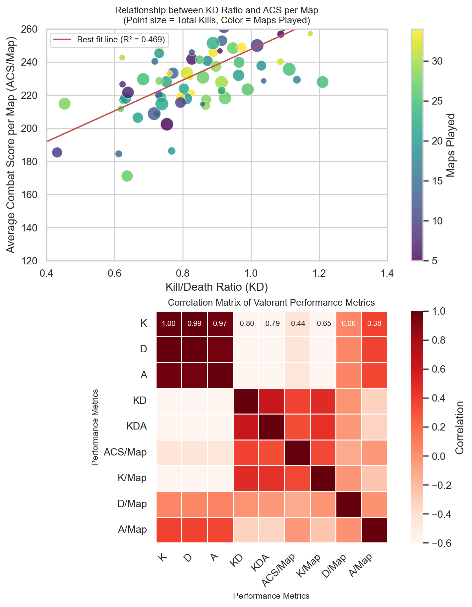
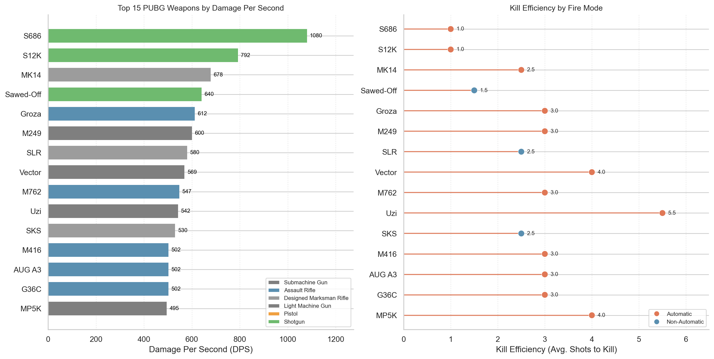

# image-to-chart

A [Claude Code skill](https://docs.claude.com/en/docs/claude-code/skills) that turns any chart image into runnable Python (matplotlib + seaborn) via a tight visual feedback loop.

The skill triggers automatically when you show Claude a chart and ask for the Python source — phrases like *"recreate this chart in Python"*, *"reproduce this figure with matplotlib"*, *"用 Python 复现这张图"*, *"写代码画出这个图"*, *"给我 plot 代码"*, *"重画"* all fire it.

> **TL;DR.** Attach a chart image (and optionally a `.csv`/`.xlsx`) → ask for Python → Claude drafts a `.py`, runs it, renders a PNG, compares against the original, iterates → you get a `.py` + `.png` you can edit and re-run.

---

## Example: reproduce a 2-panel figure

A typical use case is a research-paper figure with a scatter + correlation heatmap stacked vertically. The input might look like this:

```
[input image: 2 vertical panels
  - top: scatter plot of "Kill/Death Ratio (KD)" vs "Average Combat Score per Map (ACS/Map)"
    - points colored by "Maps Played" (viridis colormap)
    - size = "Total Kills"
    - red regression line with "Best fit line (R² = 0.669)" annotation
  - bottom: correlation matrix heatmap (8x8)
    - Reds colormap, diverging around 0
    - annotated values
    - labels rotated 45°]
```

You say: *"Recreate this figure with matplotlib."*

Claude reads `references/scatter.md` and `references/heatmap.md`, estimates ~50 (KD, ACS) points and the 8x8 correlation matrix from the image, drafts a `.py` using `plt.subplots(2, 1, ...)`, and runs the compile script:

```bash
$ ./scripts/compile_and_preview.sh chart.py
[1/1]  python3 chart.py
✓ output.png  (1024×1400, 200 dpi)
```

The result is `output.png` — a matplotlib figure that visually matches the source. If a color is wrong or a panel is misaligned, you say *"fix X"* and the skill iterates.

### Real examples

Two paper-style figures the skill has reproduced end-to-end, with the source `.py` files bundled in `examples/`:

**Example 1 — Valorant-style scatter + correlation heatmap** (2 vertical panels × ~80 scatter points × 9×9 correlation matrix). Source: a research chart from `Realchart2code-raw/1.png`.



→ `examples/chart_scatter_heatmap.py` (3.5 KB, runs in ~1 s with `python3`).

**Example 2 — PUBG weapons: horizontal bar + lollipop** (2 side-by-side panels × 15 weapons × 2 metrics: DPS and Kill Efficiency). Source: `Realchart2code-raw/2.png`.



→ `examples/chart_bar_lollipop.py` (5.4 KB, runs in ~1 s with `python3`).

Both render with the same `matplotlib` + `seaborn` machinery — the only differences are the figure shape (`subplots(2, 1)` vs `subplots(1, 2)`), the chart primitives (`scatter`/`heatmap` vs `barh`/`hlines`+`scatter`), and the legend construction (auto vs. manual `Patch`/`Line2D` handles). The skill picks up the differences automatically once it sees the source image.

---

## The visual feedback loop

```
   ┌──────────────────────────────────────────────────────────────┐
   │                                                              │
   │   image  ──▶  draft .py  ──▶  python3 .py  ──▶  render PNG   │
   │                                              │               │
   │                                              ▼               │
   │                                       compare against        │
   │                                         original image       │
   │                                              │               │
   │      ┌───── "looks right" ───────────────────┘               │
   │      │                                                       │
   │      ▼                                                       │
   │   refine .py ──▶  re-run ──▶  re-render ──▶ re-compare       │
   │      │                                                       │
   │      └─────────────────────── loop ─────────────────────┐    │
   │                                                          │    │
   └──────────────────────────────────────────────────────────────┘
```

**Why a feedback loop matters.** Matplotlib is large and opinionated. Tiny differences in `cmap`, `alpha`, `edgecolor`, `gridspec` width ratios, or `tight_layout` vs. `constrained_layout` produce visually different output. **The fastest path to a good result is to actually run the script, look at the rendered PNG, and iterate.** Run time is sub-second for most figures. Use it freely.

Most charts converge in 2–4 iterations.

---

## Quick start

### 1. Install

```bash
# from the packaged .skill zip
unzip image-to-chart.skill -d ~/.claude/skills/image-to-chart

# OR copy the contents of this directory there
cp -r . ~/.claude/skills/image-to-chart/
```

Claude Code picks it up automatically — no restart required.

You'll also need Python packages:

```bash
pip install matplotlib seaborn pandas numpy
# Optional, only if the figure needs them:
pip install networkx scikit-learn
```

### 2. Use it

Open Claude Code, attach a chart image, and ask for the Python.

| You say | What happens |
|---|---|
| *"Recreate this scatter plot in Python."* | Claude reads `references/scatter.md`, uses `sns.scatterplot` or `plt.scatter`. |
| *"Give me matplotlib code for this bar chart."* | Claude reads `references/bar.md`, uses `plt.barh` or `sns.barplot`. |
| *"用 Python 复现这张 heatmap。"* | Claude reads `references/heatmap.md`, uses `sns.heatmap`. |
| *"Reproduce this violin plot in matplotlib."* | Claude reads `references/distribution.md`, uses `sns.violinplot`. |
| *"Write Python code for this 2×2 panel figure."* | Claude reads `references/multi-panel.md`, uses `plt.subplots(2, 2, ...)`. |
| *"用 Python 重画这个雷达图 / 平行坐标 / 网络图。"* | Claude reads `references/specialized.md`. |

### 3. Iterate

If the first render isn't right, just tell Claude what's off:

> *"The colorbar range is wrong — it should be 0 to 35, not 5 to 35."*
> *"The heatmap labels need to be rotated 45°."*
> *"The regression line slope is too steep."*
> *"Change the bar color to match the original (orange).*

The skill refines and re-renders. **Stop when a side-by-side glance at the PNG and the original image looks right.**

---

## What it handles

Each reference contains a canonical example, the matplotlib/seaborn calls to use, and the few pitfalls that actually break things.

| Chart type | Reference | Library/API | Pitfall highlight |
|---|---|---|---|
| **Scatter** (regression, density, categorical color) | [`references/scatter.md`](references/scatter.md) | `plt.scatter`, `sns.scatterplot`, `sns.regplot` | When point size encodes a variable, pass `s=` as an array — not a single number. |
| **Bar** (vertical, horizontal, stacked, lollipop) | [`references/bar.md`](references/bar.md) | `plt.bar`, `plt.barh`, `sns.barplot` | Horizontal bars need `width=` not `height=`; category order on y-axis is bottom-up by default. |
| **Line / multi-series / area** | [`references/line.md`](references/line.md) | `plt.plot`, `plt.fill_between`, `sns.lineplot` | Multiple series in one `plot()` call vs. one per call changes the legend grouping. |
| **Heatmap** (correlation, 2D density, hexbin) | [`references/heatmap.md`](references/heatmap.md) | `sns.heatmap`, `plt.hexbin`, `plt.hist2d` | Diverging colormaps (e.g. `RdBu_r`) need `center=0` to look right. |
| **Distribution** (hist, KDE, violin, box) | [`references/distribution.md`](references/distribution.md) | `plt.hist`, `sns.histplot`, `sns.violinplot`, `sns.boxplot` | Histogram with KDE overlay needs `stat='density'` + `kde=True`. |
| **Multi-panel** (gridspec, 2×2, side-by-side) | [`references/multi-panel.md`](references/multi-panel.md) | `plt.subplots`, `gridspec.GridSpec` | Use `constrained_layout=True` (not `tight_layout`) when any panel has a colorbar. |
| **Specialized** (radar, parallel coords, network, PCA) | [`references/specialized.md`](references/specialized.md) | `mpl_toolkits`, `pandas.plotting`, `networkx`, `sklearn` | Radar needs manual polar projection; parallel coords needs `pandas.plotting.parallel_coordinates`. |
| **Cross-cutting style** | [`references/styling.md`](references/styling.md) | `sns.set_theme`, `plt.rcParams` | Seaborn themes override per-axes `set_facecolor`. Apply theme BEFORE creating subplots. |

---

## Data: estimated vs. supplied

The skill supports both data modes:

**Default — estimate from image.** Claude reads axis ticks, point positions, bar heights, and color categories from the source, then synthesizes a NumPy/Pandas DataFrame. The goal is **visual match**, not data fidelity. If the original chart shows ~50 scatter points with KD ∈ [0.4, 1.2] and ACS ∈ [120, 260], the synthesized data should fall in that same range. The exact (x, y) values don't need to match.

**Override — use supplied data.** If the user attaches a `.csv`/`.xlsx`/`.json` alongside the chart, Claude reads it with `pd.read_csv` and uses it directly. This produces a chart whose data exactly matches the source.

Claude decides which mode to use based on whether a data file is attached.

---

## Worked example: minimal 2-panel scatter + heatmap

A 2-panel figure in ~25 lines of Python, from `references/multi-panel.md`:

```python
import numpy as np
import matplotlib.pyplot as plt
import seaborn as sns

sns.set_theme(style='whitegrid')
rng = np.random.default_rng(0)

# Panel 1: scatter
x = rng.normal(0.8, 0.15, 80)
y = 150 + 100 * x + rng.normal(0, 20, 80)
c = rng.integers(5, 35, 80)
s = rng.integers(20, 200, 80)

fig, (ax1, ax2) = plt.subplots(2, 1, figsize=(7, 9), constrained_layout=True)
sc = ax1.scatter(x, y, c=c, s=s, cmap='viridis', alpha=0.8, edgecolor='white')
ax1.plot([0.4, 1.2], [110, 270], 'r-', lw=1.5, label='Best fit line (R² = 0.67)')
ax1.set_xlabel('Kill/Death Ratio (KD)')
ax1.set_ylabel('Average Combat Score per Map (ACS/Map)')
fig.colorbar(sc, ax=ax1, label='Maps Played')

# Panel 2: heatmap
corr = np.corrcoef(np.column_stack([x, y, rng.normal(size=(80, 6))].T))
sns.heatmap(corr, ax=ax2, annot=True, fmt='.2f', cmap='RdBu_r', center=0)
ax2.set_title('Correlation Matrix')

plt.savefig('output.png', dpi=200, bbox_inches='tight')
```

Compile with `python3 chart.py` and you get a renderable PNG. The full skill handles arbitrarily complex figures (3×3 grids, mixed chart types, network overlays) — but the shape is always the same: a theme call, a subplots call, per-panel plotting calls, and one final `savefig`.

---

## Repository layout

```
image-to-chart/
├── SKILL.md                # the manifest Claude reads to decide when to trigger
├── README.md               # this file
├── references/             # per-chart-type guides (loaded as needed)
│   ├── scatter.md
│   ├── bar.md
│   ├── line.md
│   ├── heatmap.md
│   ├── distribution.md
│   ├── multi-panel.md
│   ├── specialized.md
│   └── styling.md
├── scripts/
│   ├── compile_and_preview.sh   # python3 + sips/gs, prints PNG path
│   └── grade.py                 # assertion-based grader
├── assets/                 # starting templates (copy one, then edit)
│   ├── scatter-template.py
│   ├── bar-template.py
│   ├── line-template.py
│   ├── heatmap-template.py
│   ├── distribution-template.py
│   ├── multi-panel-template.py
│   └── specialized-template.py
└── examples/               # worked end-to-end reproductions
    ├── chart_scatter_heatmap.py/.png
    └── chart_bar_lollipop.py/.png
```

---

## What "done" looks like

- All panels, labels, legends, and annotations from the original appear in the rendered PNG
- Layout and aspect ratio match
- Colors and statistical overlays match within reason
- A human glancing at the two side-by-side would recognize them as the same chart
- The script runs cleanly with `python3 script.py` and exits 0

The skill deliberately stops at "visually close" — pixel-perfect reproduction is not the goal.

## Limitations

- The skill does **not** OCR arbitrary axis values from low-resolution images — it expects the user to have given Claude a high-fidelity image, and Claude uses its multimodal capability to read it. If a tick value is illegible, the skill leaves a placeholder rather than guessing.
- It does **not** edit pre-existing matplotlib scripts — it writes them from scratch.
- It does **not** generate raw data without a target chart — use a data analysis tool for that.

## License

MIT.
