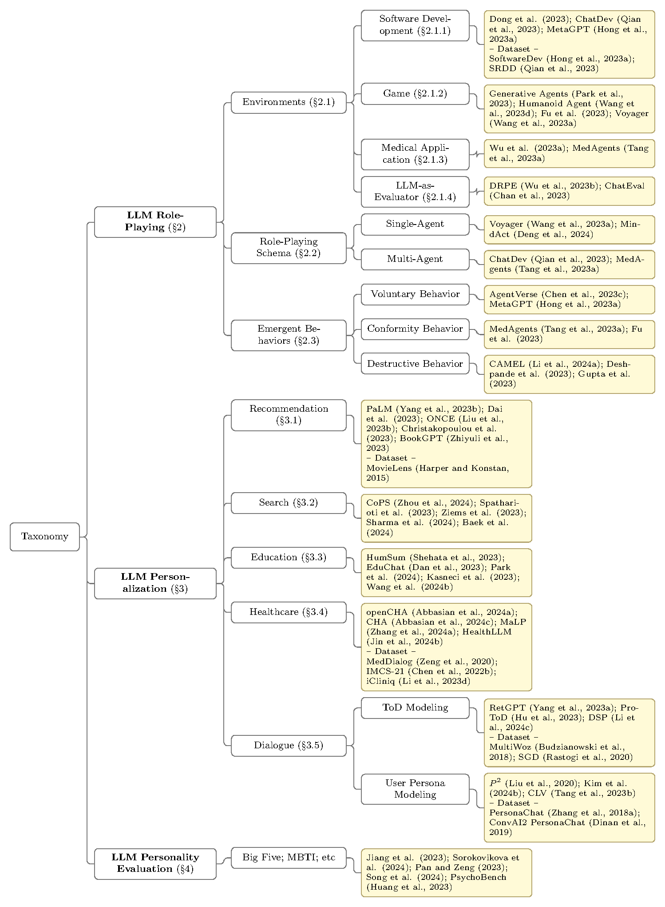
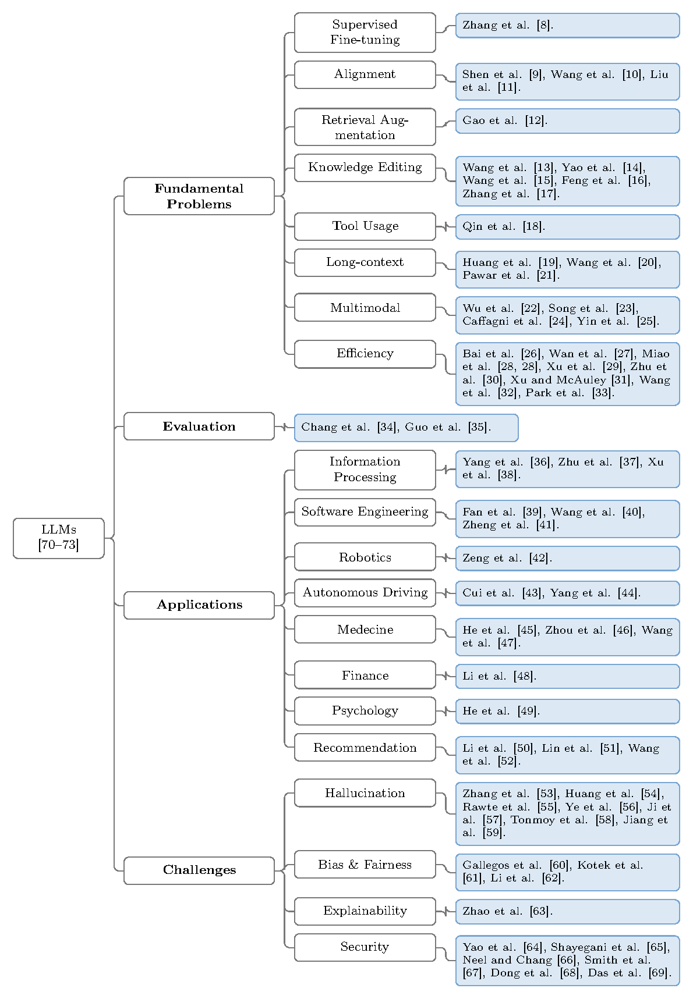

# image-to-latex

A [Claude Code skill](https://docs.claude.com/en/docs/claude-code/skills) that turns any image into compilable LaTeX via a tight visual feedback loop.

The skill triggers automatically when you show Claude an image and ask for the LaTeX source — phrases like *"recreate this in LaTeX"*, *"reproduce this figure"*, *"turn this screenshot into LaTeX"*, *"用 LaTeX 写出来"*, *"复现这张图"*, *"重画"* all fire it.

> **TL;DR.** Attach an image → ask for LaTeX → Claude drafts, compiles, renders a PNG, and iterates until it matches → you get a `.tex` + `.pdf` + `.png`.

---

## Example: paper taxonomy → LaTeX forest

A typical use case is reproducing a hierarchical taxonomy figure from a survey paper. The input might look like this:

```
[input image: a paper figure with 3 L1 branches
  - LLM Role-Playing (§2)
    - Environments (§2.1) → Software Dev / Game / Medical / LLM-as-Evaluator
    - Role-Playing Schema (§2.2) → Single-Agent / Multi-Agent
    - Emergent Behaviors (§2.3) → Voluntary / Conformity / Destructive
  - LLM Personalization (§3)
    - Recommendation / Search / Education / Healthcare / Dialogue
  - LLM Personality Evaluation (§4)
    - Big Five; MBTI; etc.
  Each leaf carries a list of citing works.]
```

You say: *"Recreate this taxonomy tree in LaTeX."*

Claude reads `references/tree.md`, drafts a `.tex` using the `forest` package, and runs the compile script:

```bash
$ ./scripts/compile_and_preview.sh tree.tex
[1/{n}]  pdflatex tree.tex
Output written on tree.pdf (1 page, 63185 bytes).
[2/{n}]  pdflatex tree.tex   (resolve forest references)
[3/{n}]  sips -s format png tree.pdf --out tree.png
tree.png  ✓
```

The result is `tree.png` — a rendered LaTeX figure you can drop into your own paper. If a branch is in the wrong place or a citation is missing, you say *"fix X"* and the skill iterates.

### Real examples

Two paper-taxonomy figures the skill has reproduced end-to-end, with the source `.tex` files bundled in `examples/`:

**Example 1 — LLM Role-Playing taxonomy** (3 L1 branches × multi-level sub-categories × pale-yellow citation leaves). Source: a survey-paper screenshot.



→ `examples/taxonomy-llm-role-playing.tex` (4.6 KB, compiles in ~1 s with `pdflatex`).

**Example 2 — LLMs survey taxonomy** (4 L1 branches × 8 L2 sub-categories × numbered `[8]…[69]` citation leaves, light blue). Source: a phone-camera shot of a survey figure.



→ `examples/taxonomy-llms-survey.tex` (3.8 KB, same `forest` machinery, just different colors and a deeper tree).

Both render with the same `forest` + `xcolor` pattern from `references/tree.md` — only the `\definecolor` values and the bracket count change between them. The skill picks up the differences automatically once it sees the source image.

---

## The visual feedback loop

```
   ┌──────────────────────────────────────────────────────────────┐
   │                                                              │
   │   image  ──▶  draft .tex  ──▶  pdflatex  ──▶  render PNG     │
   │                                              │               │
   │                                              ▼               │
   │                                       compare against        │
   │                                         original image       │
   │                                              │               │
   │      ┌───── "looks right" ───────────────────┘               │
   │      │                                                       │
   │      ▼                                                       │
   │   refine .tex ──▶  recompile ──▶  re-render ──▶ re-compare  │
   │      │                                                       │
   │      └─────────────────────── loop ─────────────────────┐    │
   │                                                          │    │
   └──────────────────────────────────────────────────────────────┘
```

**Why a feedback loop matters.** LaTeX is unforgiving — tiny differences in `text width`, `align`, escape characters, or package choice produce wildly different output. Trying to predict the final rendering by reading the source is unreliable. **The fastest path to a good result is to actually compile, look at the rendered image, and iterate.** Compilation is cheap (under a second for most documents). Use it freely.

Most documents converge in 2–4 iterations.

---

## Quick start

### 1. Install

```bash
# from the packaged .skill zip
unzip image-to-latex.skill -d ~/.claude/skills/image-to-latex

# OR just copy the contents of this directory there
cp -r . ~/.claude/skills/image-to-latex/
```

Claude Code picks it up automatically — no restart required.

### 2. Use it

Open Claude Code, attach an image, and ask for the LaTeX.

| You say | What happens |
|---|---|
| *"Recreate this tree diagram in LaTeX."* | Claude reads `references/tree.md`, uses the `forest` package. |
| *"Give me the LaTeX source for this table."* | Claude reads `references/table.md`, uses `booktabs` + `colortbl`. |
| *"用 LaTeX 复现这张公式推导图。"* | Claude reads `references/math.md`, uses `align`/`cases`/`bm`. |
| *"Reproduce this flowchart in LaTeX."* | Claude reads `references/flowchart.md`, uses `tikz` nodes + arrows. |
| *"Turn this paper page into LaTeX."* | Claude reads `references/mixed-page.md` plus the relevant single-type references. |

### 3. Iterate

If the first render isn't right, just tell Claude what's off:

> *"The third branch is connecting to the wrong parent."*
> *"The leaf labels are being clipped on the right."*
> *"Change the box color to light blue."*

The skill refines and re-renders. **Stop when a side-by-side glance at the PNG and the original image looks right.**

---

## What it handles

Each reference file contains a canonical example plus the few pitfalls that actually break things (e.g. why `[...]` inside a `forest` node label can silently render an empty box, and how to escape it).

| Content type | Reference | LaTeX machinery | Pitfall highlight |
|---|---|---|---|
| **Tree / hierarchy / mind map** | [`references/tree.md`](references/tree.md) | `forest` package, custom `tikz` node styles | Square brackets inside a node label break the parser — wrap the whole label in `{}`. |
| **Table** (merged cells, colored headers) | [`references/table.md`](references/table.md) | `booktabs`, `multirow`, `multicolumn`, `colortbl` | `\rowcolor` requires `\usepackage{colortbl}` even if `xcolor` is already loaded. |
| **Math equation / derivation / matrix** | [`references/math.md`](references/math.md) | `align`, `cases`, `bm`, `\mathcal`, `\mathbb` | Don't reuse `=` as an alignment point when the derivation has both `=` and `\leq` / `\approx` — pick the *first* symbol that appears in every line. |
| **Code block / quote / theorem / definition box** | [`references/code-and-quote.md`](references/code-and-quote.md) | `listings`, `tcolorbox` | Underscores in text mode need `\_`. The `listings` package handles them inside code blocks. |
| **Flowchart / architecture diagram** | [`references/flowchart.md`](references/flowchart.md) | `tikz` nodes + arrows | `text width=...` + `align=...` is what enables word wrap inside a node. Without it, the node grows to fit content on one line. |
| **Page with several of the above** | [`references/mixed-page.md`](references/mixed-page.md) | combine any of the above | Use `\documentclass[11pt, a4paper]{article}` for full pages, `\documentclass[border=10pt]{standalone}` for a single figure. |

---

## Worked example: minimal tree

A 3-node tree in 6 lines of LaTeX, taken from `references/tree.md`:

```latex
\documentclass[border=10pt]{standalone}
\usepackage{forest}
\begin{document}
\begin{forest}
  for tree={draw, rounded corners, parent anchor=south, child anchor=north}
  [Root
    [Child A
      [Grandchild A1]
      [Grandchild A2]
    ]
    [Child B]
  ]
\end{forest}
\end{document}
```

Compile with `pdflatex minimal-tree.tex` and you get a renderable PDF. The full skill handles arbitrarily deep trees with custom node styles, citation leaves, color palettes, and connector routing — but the shape is always the same: a `forest` environment, a `for tree={...}` style block, and a nested bracket list.

---

## Repository layout

```
image-to-latex/
├── SKILL.md                # the manifest Claude reads to decide when to trigger
├── README.md               # this file
├── references/             # per-content-type guides (loaded as needed)
│   ├── tree.md
│   ├── table.md
│   ├── math.md
│   ├── code-and-quote.md
│   ├── flowchart.md
│   └── mixed-page.md
├── scripts/
│   ├── compile_and_preview.sh   # pdflatex + sips, prints PNG path
│   └── grade.py                 # assertion-based grader
├── assets/                 # starting templates (copy one, then edit)
│   ├── tree-template.tex
│   ├── table-template.tex
│   ├── math-template.tex
│   ├── flowchart-template.tex
│   ├── code-template.tex
│   └── mixed-page-template.tex
└── examples/               # worked end-to-end reproductions
    ├── taxonomy-llm-role-playing.tex
    ├── taxonomy-llm-role-playing.png
    ├── taxonomy-llms-survey.tex
    └── taxonomy-llms-survey.png
```

---

## What "done" looks like

- All textual content from the original appears in the rendered PNG
- Structural relationships are correct (branches, cell spans, alignment points)
- A human glancing at the two side-by-side would recognize them as the same figure
- The output compiles cleanly with no errors (warnings are fine)

The skill deliberately stops at "visually close" — pixel-perfect reproduction is not the goal.

## Limitations

- The skill does **not** OCR arbitrary images from scratch — it expects the user to have given Claude a high-fidelity image, and Claude uses its multimodal capability to read it. If a region is blank, low-contrast, or illegible, the skill leaves space rather than inventing content.
- It does **not** extract text from PDFs (use a dedicated PDF parser for that).
- It does **not** compile pre-existing `.tex` files written outside the skill's workflow.

## License

MIT.
